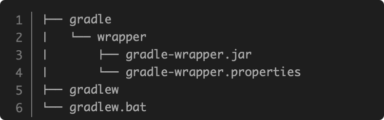

# 03. Gradle Tools

## 3.1 如何生产Gradle Wrapper

```shell
gradle wrapper
```
详细目录结构输出如下：


## 3.2 如何发布Zip包

```
task zip(type: Zip, group: "Archive", description: "Archives sources in a zip file") {
    from "src"
    setArchiveName "basic-demo-1.0.zip"
}
```

