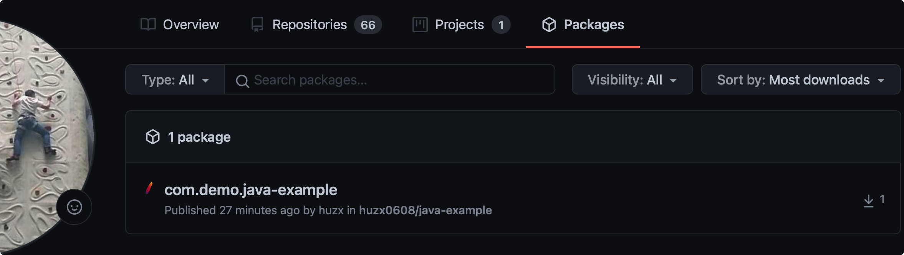

# 04. Using Github as Maven and Docker Repository

## 4.1 Using Github as Maven Repository 

### 4.1.1 背景介绍

要做开源产品，则需要有外部完善的工具生态来管理产品的CI/CD, 版本管理等工作。这里主要讨论如何进行产品发的发布流程。

### 4.1.2 产品发布的流程

#### 4.1.2.1 前置条件

需要启动GITHUB_TOKEN，具体启用GITHUB_Token的流程，参考链接：[Github Token](https://docs.github.com/en/authentication/keeping-your-account-and-data-secure/creating-a-personal-access-token).
```
Github Token可以开启对 Github所有资源的访问控制权限，比如 Github packages, Github repository等。
```

#### 4.1.2.2 发布Jar到Github的具体流程

官网提供的发布流程，详细参考页面，[Working with the Apache Maven registry](https://docs.github.com/en/packages/working-with-a-github-packages-registry/working-with-the-apache-maven-registry)。具体流程说明如下：

##### 4.1.2.2.1 修改setting.xml配置

```xml
<settings xmlns="http://maven.apache.org/SETTINGS/1.0.0"
  xmlns:xsi="http://www.w3.org/2001/XMLSchema-instance"
  xsi:schemaLocation="http://maven.apache.org/SETTINGS/1.0.0
                      http://maven.apache.org/xsd/settings-1.0.0.xsd">

  <activeProfiles>
    <activeProfile>github</activeProfile>
  </activeProfiles>

  <profiles>
    <profile>
      <id>github</id>
      <repositories>
        <repository>
          <id>central</id>
          <url>https://repo1.maven.org/maven2</url>
        </repository>
        <repository>
          <id>github</id>
          <url>https://maven.pkg.github.com/huzx0608/*</url>
          <snapshots>
            <enabled>true</enabled>
          </snapshots>
        </repository>
      </repositories>
    </profile>
  </profiles>

  <servers>
    <server>
      <id>github</id>
      <username>huzx0608</username>
      <password>xxxToken</password>
    </server>
  </servers>
</settings>
```

##### 4.1.2.2.2 修改项目pom.xml配置

URL中的地址需要与源端项目地址一致，否则会找不到对应的项目。

```xml
  <distributionManagement>
    <repository>
      <id>github</id>
      <name>GitHub OWNER Apache Maven Packages</name>
      <url>https://maven.pkg.github.com/huzx0608/java-example</url>
    </repository>
 </distributionManagement>
```

##### 4.1.2.2.3 发布项目

```shell
mvn deploy
```

##### 4.1.2.2.4 检查是否部署成功




### 4.1.3 如何将已存在的Jar发布到Github package中

```shell
mvn deploy:deploy-file \
    -Dfile=./xxxx-6.14.6.jar \
    -DrepositoryId=github \
    -Durl=https://maven.pkg.github.com/xxxx/xxx-111 \
    -DgroupId=datacanvas.io.dingo \
    -Dpacking=jar \
    -DartifactId=xxxx \
    -Dversion=6.14.6 \
    -Dtoken=xxxxx
```

### 4.1.4 如何release对应版本到github上


## 4.2 Using Github as Docker Repository
