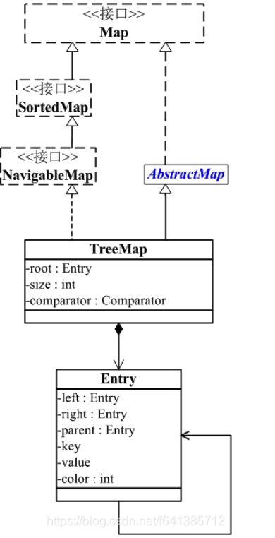

# Navigable Map

## 介绍

R-B Tree，全称是Red-Black Tree，又称为“红黑树”，它一种特殊的二叉查找树。红黑树的每个节点上都有存储位表示节点的颜色，可以是红(Red)或黑(Black)。红黑树的特性:

1. 每个节点或者是黑色，或者是红色。
2. 根节点是黑色。
3. 每个叶子节点（NIL）是黑色。 [注意：这里叶子节点，是指为空(NIL或NULL)的叶子节点！]
4. 如果一个节点是红色的，则它的子节点必须是黑色的。
5. 从一个节点到该节点的子孙节点的所有路径上包含相同数目的黑节点。

## 应用场景

红黑树的应用比较广泛，主要是用它来存储有序的数据，它的时间复杂度是O(lgn)，效率非常之高。
例如，Java集合中的TreeSet和TreeMap，C++ STL中的set、map，以及Linux虚拟内存的管理，都是通过红黑树去实现的。

## NavigableMap 与 TreeMap之间的关系

root 是紅黑數的根節點。它是Entry型別，Entry是紅黑數的節點，它包含了紅黑數的6個基本組成成分：key(鍵)、value(值)、left(左孩子)、right(右孩子)、parent(父節點)、color(顏色)。Entry節點根據key進行排序，Entry節點包含的內容為value。




## TreeMap

- TreeMap 是一个有序的key-value集合，它是通过红黑树实现的。
- TreeMap 继承于AbstractMap，所以它是一个Map，即一个key-value集合。
- TreeMap 实现了NavigableMap接口，意味着它支持一系列的导航方法。比如返回有序的key集合。
- TreeMap 实现了Cloneable接口，意味着它能被克隆。
- TreeMap 实现了java.io.Serializable接口，意味着它支持序列化。
- TreeMap基于红黑树（Red-Black tree）实现。该映射根据其键的自然顺序进行排序，或者根据创建映射时提供的 Comparator 进行排序，具体取决于使用的构造方法。
- TreeMap的基本操作 containsKey、get、put 和 remove 的时间复杂度是 log(n) 。


### 实例

```java
       NavigableMap<String, Integer> navigableTree = new TreeMap<String, Integer>() {{
            put("aa", 11);
            put("bb", 22);
            put("cc", 33);
            put("dd", 44);
            put("ee", 55);
            put("ff", 55);
            put("gg", 55);
        }};

        System.out.println(navigableTree.ceilingKey("cc"));
        System.out.println(navigableTree.ceilingEntry("cc"));

        System.out.println(navigableTree.floorEntry("c"));
        System.out.println(navigableTree.headMap("ee"));

```
