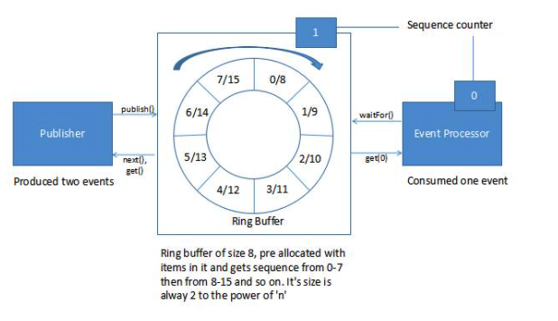

# Disruptor

## 介绍

- Disruptor介绍

Disruptor is an open source Java library written by LMAX. It is a concurrent programming framework for the processing of a large number of transactions, with low-latency (and without the complexities of concurrent code). The performance optimization is achieved by a software design that exploits the efficiency of underlying hardware.

- Why Not Queueus

Queue implementations tend to have write contention on the head, tail, and size variables. Queues are typically always close to full or close to empty due to the differences in pace between consumers and producers. They very rarely operate in a balanced middle ground where the rate of production and consumption is evenly matched.

To deal with the write contention, a queue often uses locks, which can cause a context switch to the kernel. When this happens the processor involved is likely to lose the data in its caches.

To get the best caching behavior, the design should have only one core writing to any memory location (multiple readers are fine, as processors often use special high-speed links between their caches). Queues fail the one-writer principle.

If two separate threads are writing to two different values, each core invalidates the cache line of the other (data is transferred between main memory and cache in blocks of fixed size, called cache lines). That is a write-contention between the two threads even though they're writing to two different variables. This is called false sharing, because every time the head is accessed, the tail gets accessed too, and vice versa.


## How Disruptor works




Disruptor has an array based circular data structure (ring buffer). It is an array that has a pointer to next available slot. It is filled with pre-allocated transfer objects. Producers and consumers perform writing and reading of data to the ring without locking or contention.

In a Disruptor, all events are published to all consumers (multicast), for parallel consumption through separate downstream queues. Due to parallel processing by consumers, it is necessary to coordinate dependencies between the consumers (dependency graph).

Producers and consumers have a sequence counter to indicate which slot in the buffer it is currently working on. Each producer/consumer can write its own sequence counter but can read other's sequence counters. The producers and consumers read the counters to ensure the slot it wants to write in is available without any locks.

## 使用实例

### Init Disruptor

```java
ThreadFactory threadFactory = DaemonThreadFactory.INSTANCE;

WaitStrategy waitStrategy = new BusySpinWaitStrategy();
Disruptor<ValueEvent> disruptor 
  = new Disruptor<>(
    ValueEvent.EVENT_FACTORY, 
    16, 
    threadFactory, 
    ProducerType.SINGLE, 
    waitStrategy);
```

In the constructor of Disruptor, the following are defined:

- Event Factory – Responsible for generating objects which will be stored in ring buffer during initialization
- The size of Ring Buffer – We have defined 16 as the size of the ring buffer. It has to be a power of 2 else it would throw an exception while initialization. This is important because it is easy to perform most of the operations using logical binary operators e.g. mod operation
- Thread Factory – Factory to create threads for event processors
- Producer Type – Specifies whether we will have single or multiple producers
- Waiting strategy – Defines how we would like to handle slow subscriber who doesn't keep up with producer's pace

### Bind the Consumer

```java
disruptor.handleEventsWith(getEventHandler());
```

### Start Disruptor

```java
RingBuffer<ValueEvent> ringBuffer = disruptor.start();
```

### Producing and Publishing Event

Producers place the data in the ring buffer in a sequence. Producers have to be aware of the next available slot so that they don't overwrite data that is not yet consumed.

Use the RingBuffer from Disruptor for publishing:

```java
for (int eventCount = 0; eventCount < 32; eventCount++) {
    long sequenceId = ringBuffer.next();
    ValueEvent valueEvent = ringBuffer.get(sequenceId);
    valueEvent.setValue(eventCount);
    ringBuffer.publish(sequenceId);
}
```

Here, the producer is producing and publishing items in sequence. It is important to note here that Disruptor works similar to 2 phase commit protocol. It reads a new sequenceId and publishes. The next time it should get sequenceId + 1 as the next sequenceId.

