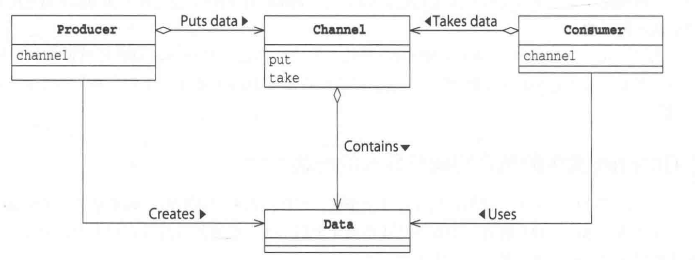
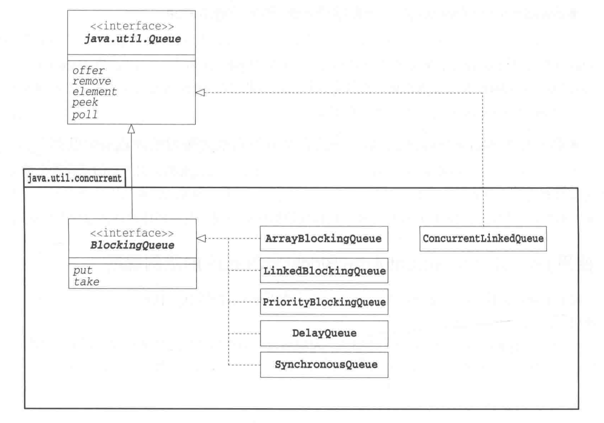
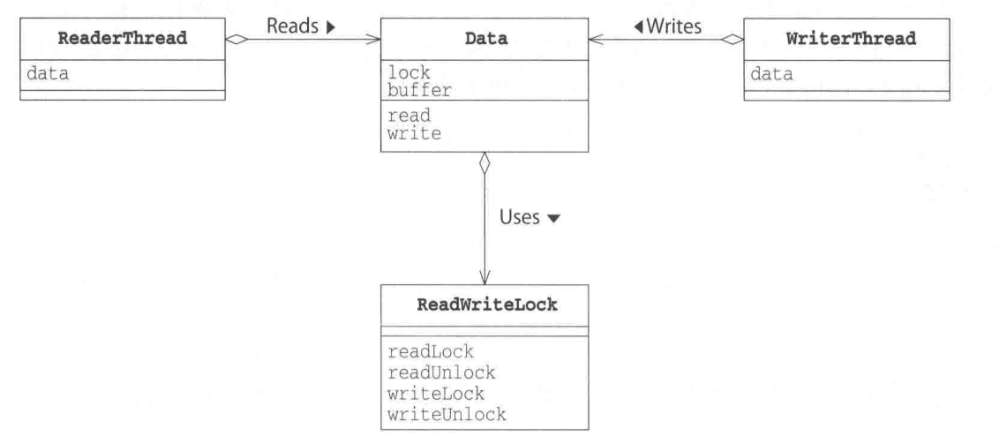
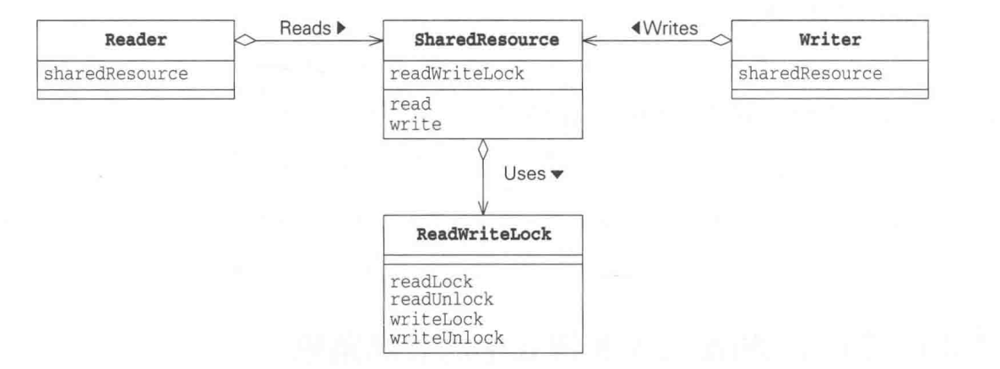

# Single Thread Execution

## Immutable 模式

### 含义

不变、不发生改变的意思

### 关键词

- final：修饰类成员、类、参数


### 角色

### 相关类库

- java.lang.StringBuffer为Mutable
- java.lang.String为Inmutable类
- java.lang.BigInt为Inmutable类
- java.lang.BigDecimal为Inmutable类
- java.util.ArrayList为非线程安全的
- Collections.synchronizedlist为线程安全的
- java.util.concurrent.CopyOnWriteArrayList为线程安全的

## Guarded Suspension模式

### 含义

通过让线程执行等待来保证实例的安全性问题。

### 角色

#### 程序说明

- RequestQueue
- ClientThread
- ServerThread
- Main
- Request

#### 角色分析

- Guarded Object(被守护的对象)

持有一个被守护的方法，条件成立立即执行，否则等待； guardedMethod通过While语句和wait方法实现。stateChangingMethod则通过notify/notifyAll来实现。

- 实现方案

- LinkedList: 需要synchronized自己保护控制
- BlockingQueue：自带功能


### 说明


### 扩展

- guarded wait

等待端：

```
java

while (!ready) {
    wait
}

```

唤醒端：

```java
ready = true;
notifyAll();
```

- busy wait

等待端：

```java
while (!ready) {
    Thread.yield();
}
```

唤醒端：
```java
ready = true;
```

- spin lock

通过旋转来锁定，指条件成立之前，通过while循环旋转等待；

- polling

进行舆论调查，反复检查某个条件是否满足条件


## Balking模式

### 含义

如果现在不适合执行这个操作，或者没必要执行这个操作，就停止处理，直接返回。Balking表示“停止并返回的意思”。

### 角色

#### 程序说明

- Data
- SaverThread
- ChangerThread
- Main

#### 角色分析

- GuardedObject

GuardedObject角色是一个拥有被防护的方法的类。当线程执行guardedMethod方法时，若条件成立，则执行实际的处理。若守护条件不成立，则不执行实际的处理，直接返回。守护条件的成立与否，会随着GuardedObject角色的状态变化而发生变化。


### 说明


### 扩展

#### 何时使用

- 并不需要执行时
- 不需要等待守护条件成立时
- 守护条件仅在第一次成立时

#### Balking vs Garded Suspension

- 与Guarded Suspension区别

一个需要等待，一个检查不满足直接返回

## Producer && Consumer

### 含义

生产者安全的将数据通过某个渠道交给消费者。

### 角色

- Data
- Producer
- Consumer
- Channel（负责安全责任）

#### 程序说明




#### 角色分析

- Channel

可能的实现方式
1、队列-先接收的先传递
2、栈-后接收的先传递
3、优先队列-“优先”的先传递


### 说明

线程的协调运行要考虑“放在中间的东西”
线程的互斥处理要考虑“应该保护的东西”

### 扩展

- InterruptedException

可能会花费时间，但可以取消。

- Sleep和Interrupt

线程A在Sleep期间，线程B可以通过interrupt方法进行状态打断。此时A会收到InterruptException

- Wait和Interrupt

当正在wait的线程调用interrupt方法时（既线程被取消执行时），该线程会在重新获取锁之后，抛出InterruptedExeption;在获取锁之前，线程不会抛出InterruptedExeption.

- Notify和interrupt区别

notify/notifyAll是java.lang.object类的方法，唤醒的是该实例的等待队列中的线程，而不是直接指定线程。notify/notifyAll唤醒的线程会执行wait的下一条语句。另外，执行notify/notifyAll时，必须要获得实例的锁。

interrupt方法时java.lang.Thread的方法，可以直接指定线程并唤醒。当被interrupt的线程处于sleep或者wait时，会抛出InterrupedException.执行interrupt（取消其他线程）时，并不需要获取要取消线程的锁。

- Join和interrupt

当线程使用join方法等待其他线程终止时，也可以通过interrupt来取消。由于join方法无需获取锁，所以线程的控制权也会立即跳转到catch语句中。

- interrupt 和 interrupted

interrupt()时让线程变为中断状态的方法
interrupted()是检查并清楚中断状态的方法

- BlockingQueue实现





## Read-Write Lock pattern

### 含义

线程的读取和写入操作分开考虑。在执行读取操作之前，必须获取用于读的锁；在执行写入操作之前，线程必须获取写入的锁。

由于当线程执行读取操作时，实例的状态没有发生变化，所以多个线程可以同时读取；但是读取时，不可以写入。

当线程执行写入操作时，实例的状态发生变化，因此当一个线程在写入时，其他线程不可以读取或者写入。

### 角色

- Data
- WriteThread
- ReaderThread
- ReadWriteLock
- Main

#### 程序说明



#### 角色分析

- Reader
- Writer
- SharedResource
- ReadWriteLock

### 说明



### 扩展

#### 使用场景

- 适合读取操作比写操作频繁的场景
- 适合读取操作繁重的场景


## AAAAAA

### 含义

### 角色

#### 程序说明

#### 角色分析

### 说明

### 扩展


