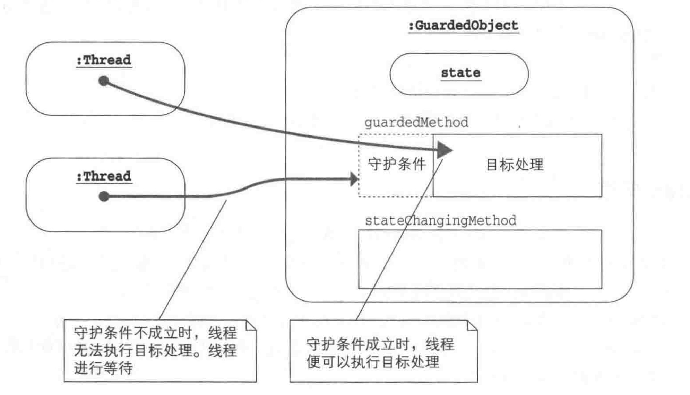
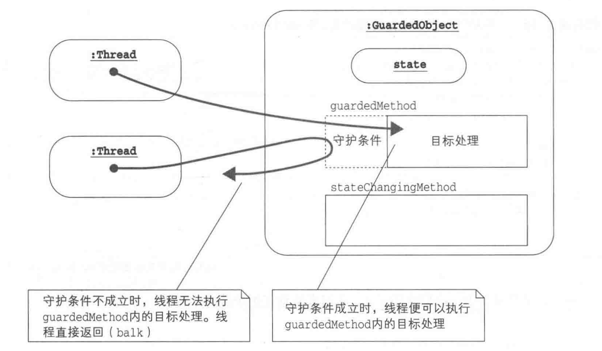

# Single Thread Execution

## Immutable 模式

### 含义

不变、不发生改变的意思

### 关键词

- final：修饰类成员、类、参数


### 角色

### 相关类库

- java.lang.StringBuffer为Mutable
- java.lang.String为Inmutable类
- java.lang.BigInt为Inmutable类
- java.lang.BigDecimal为Inmutable类
- java.util.ArrayList为非线程安全的
- Collections.synchronizedlist为线程安全的
- java.util.concurrent.CopyOnWriteArrayList为线程安全的

## Guarded Suspension模式

### 含义

通过让线程执行等待来保证实例的安全性问题。

### 角色

#### 程序说明

- RequestQueue
- ClientThread
- ServerThread
- Main
- Request

#### 角色分析

- Guarded Object(被守护的对象)

持有一个被守护的方法，条件成立立即执行，否则等待； guardedMethod通过While语句和wait方法实现。stateChangingMethod则通过notify/notifyAll来实现。

- 实现方案

- LinkedList: 需要synchronized自己保护控制
- BlockingQueue：自带功能


### 说明



### 扩展

- guarded wait

等待端：

```
java

while (!ready) {
    wait
}

```

唤醒端：

```java
ready = true;
notifyAll();
```

- busy wait

等待端：

```java
while (!ready) {
    Thread.yield();
}
```

唤醒端：
```java
ready = true;
```

- spin lock

通过旋转来锁定，指条件成立之前，通过while循环旋转等待；

- polling

进行舆论调查，反复检查某个条件是否满足条件


## Balking模式

### 含义

如果现在不适合执行这个操作，或者没必要执行这个操作，就停止处理，直接返回。Balking表示“停止并返回的意思”。

### 角色

#### 程序说明

- Data
- SaverThread
- ChangerThread
- Main

#### 角色分析

- GuardedObject

GuardedObject角色是一个拥有被防护的方法的类。当线程执行guardedMethod方法时，若条件成立，则执行实际的处理。若守护条件不成立，则不执行实际的处理，直接返回。守护条件的成立与否，会随着GuardedObject角色的状态变化而发生变化。


### 说明





### 扩展

#### 何时使用

- 并不需要执行时
- 不需要等待守护条件成立时
- 守护条件仅在第一次成立时

#### Balking vs Garded Suspension

- 与Guarded Suspension区别

一个需要等待，一个检查不满足直接返回

## Producer && Consumer

### 含义

### 角色

#### 程序说明

#### 角色分析

### 说明

### 扩展


## AAAAAA

### 含义

### 角色

#### 程序说明

#### 角色分析

### 说明

### 扩展


