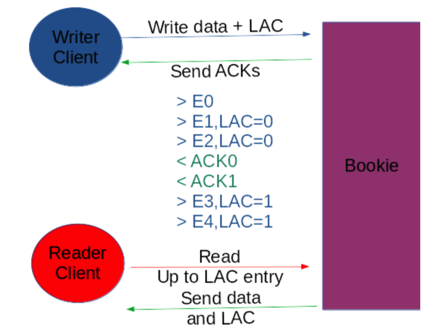

# Apache BookKeeper

In the beginning, Apache BookKeeper was designed as a distributed write ahead log for the Hadoop HDFS Namenode as part of the Apache Zookeeper project, but soon it started its own life as an independent product.

## Architecture

It comes with most of the features we need to support our replicated state machine, the main features of our interests are:
- Decentralized architecture: all of the logic runs on a rich client model, BookKeeper servers are only containers of data, this allows us to completely scale out.
- Shared nothing storage model: clients only use network, no shared disks; servers do not know about each other.
- Support for fencing: BookKeeper guarantees that only one machine is able to write to the log.
- Last Add Confirmed Protocol: BookKeeper allows the readers to follow the log consistently.
- Automatic re-replication of data on lost storage nodes: self healing in case of lost machines and network partitions.

Let's look through all of these key features, we will see how our database is able to address all of the challenges of a distributed system.

## Rich client mode

The leader node runs a BookKeeper writer (WriteHandle) and it creates a ledger. A ledger is a write only segment of our log. It can be opened for writing only once and it can be read as many times as you like. You can not append more data to a ledger once the writer closes it or in case it dies.

At creation time, you need to set three parameters about replication:

- Ensemble size (ES): the number of bookies that will store ledger's data.
- Write quorum size (WQ): the number of copies for each entry.
- Ack quorum size (AQ): the number of required copies to be acknowledged before considering a write as successful.

For instance, if you have ES=3, WQ=2 and AQ=1 for each entry, BookKeeper will:

- Spread copies over 3 bookies
- Write 2 copies of each entry
- Wait only for 1 acknowledgement in order to declare an entry to be written.

Having ES > WQ is known as striping, this helps in boosting performances because writes and reads are spread to more bookies.

The writer reacts to bookie failures and chooses new bookies to use as storage, this mechanism is known as ensemble change, if you have enough bookie this is totally transparent to the application and you do not have to care about this situation.

At every ensemble change, we start a new segment of the ledger, the readers watch changes on ledger metadata and are able to automatically connect to the new bookies.

## Fencing

In our replicated state machine model, we have only one leader that is allowed to perform changes to the state of the table. Its leadership role must be supported by all of the other peers, for instance, you could use some leader election recipe with ZooKeeper, but this won’t be enough to guarantee the overall consistency of data.

In our replicated state machine model, we have only one leader that is allowed to perform changes to the state of the table. Its leadership role must be supported by all of the other peers, for instance, you could use some leader election recipe with ZooKeeper, but this won’t be enough to guarantee the overall consistency of data.

In theory, you should implement some kind of low level distributed consensus protocol (like ZAB in ZooKeeper), but this would be overkilling, it will be really slow.

Here comes BookKeeper to the rescue.

When a node starts to act as a leader it performs a “recovery read” over every ledger supposed to be open by the previous leader.

This operation connects to every bookie that contains that ledger’s data and flags each ledger as fenced and if the previous leader is still alive it will receive a specific write error during the next write that tells that he has been fenced off.

BookKeeper handles every corner case, like network errors during recovery or multiple concurrent recovery operations.

You are guaranteed that only one machine will succeed in the recovery and then it can start to perform new changes to the status of the database.

But BookKeeper deals only with ledgers and you have to store somewhere the list of ledgers that are building up your write ahead log. This secondary metadata storage must handle some sort of fencing as well.

One option is to store this list on ZooKeeper and leverage its built-in distributed compare-and-set facility to deal with concurrent leaders that want to add a new ledger to the list of active ledgers. Please refer to the BookKeeper Tutorial for an example of how to deal with this part of the story.

BookKeeper provides a higher-level API, DistributedLog, that does this part for you and adds a lot of built-in features to BookKeeper low-level API.

## Last add confirmed protocol

Each node is now using only Zookeeper and BookKeeper in order to communicate with the other peers. Let’s see how can a follower know that the leader is making progress and it is time to look for new entries.

Every time the writer adds an entry to a ledger, it also writes the greatest entry id for which it has received an acknowledgment of successful store by an AQ of bookies, we name this id the Last-Add-Confirmed entry (LAC).

Usually, the writer is faster in sending writes than the bookie to persist them and to send back an acknowledgment message, so entries would be potentially available for readers even if the writer is not considering them as persisted.

This is very dangerous because this way follower nodes may have a future view of data that has not still been accepted by the leader.

In order to address this case BookKeeper readers can read only entries up to the LAC entry. You are guaranteed that the reader is always one step behind the writer.

Readers get this LAC during reads (it is piggy backed) by reading ledger’s metadata and asking the bookies associated with the ledger.

Let’s see a usual tricky case for new users of BookKeeper: the writer writes entry X and X-1 as LAC, so readers can see only up to X-1, if no more entries are written, that the follower is not able to be up to date. This is not a real problem in production, especially under heavy load, but it is difficult to understand especially the first time you play with BookKeeper.

You have to ways to fix this issue:

- Periodically write a dummy entry if you haven't written anything
- Use the ExplicitLAC feature, this basically stores a secondary LAC pointer out of the regular piggybacking mechanism

There are ways to bypass LAC protocol but this blog does not introduce them because they are not useful in our use case.

## Close a ledger

BookKeeper is optimized for high throughput but the most important features are about the consistency guarantees and this is mostly about metadata management both using ZooKeeper and the built-in fencing mechanisms.

One critical point is when you have to define the actual series of valid entries visible to readers, especially the id of the last entry.

There are several mechanics that come into play because the writer may fail and also network may fail but in the end, the writer or the recovery procedure will come to seal this range of valid entry ids.

We call this operation ‘closing’ a ledger and basically it is about writing to Zookeeper the final state of the ledger and this happens when out ‘close’ your WriteHandle. After closing a ledger, the reader is able to read up the last written entry.

## Wrap Up

It is a good choice to use BookKeeper as a distributed write ahead log since it deals with many aspects of distributed systems. If you want to write your own log, you will fall into a lot of corner cases only when it will be too late.

Therefore, BookKeeper was designed from the ground up to be a high-performance storage system, with lots of improvements and tricks about local disk storage management, network usage, and JVM performance.
