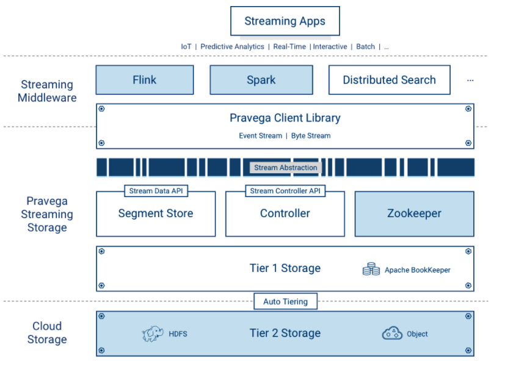
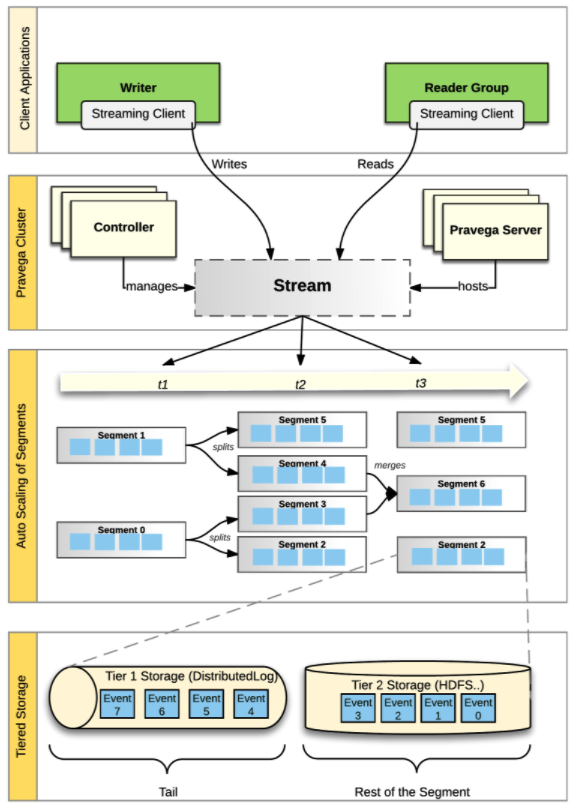
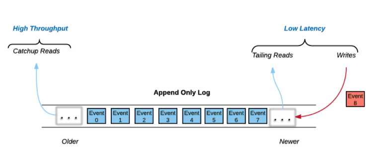

# Apache Pravega

## Architecture



Pravega is deployed as a distributed system – a cluster of servers and storage coordinated to run Pravega called a Pravega cluster.  

Pravega presents a software-defined storage (SDS) architecture formed by Controller instances (`control plane`) and Pravega Servers (`data plane`). The set of Pravega Servers is collectively known as the Segment Store. 

The set of Controller instances together forms the control plane of Pravega, providing functionality to create, update and delete Streams. Further, it extends the functionality to retrieve information about the Streams, monitor the health of the Pravega cluster, gather metrics, etc. There are usually multiple (recommended at least 3) Controller instances running in a running in a cluster for high availability.  

The Segment Store implements the Pravega data plane. Pravega Servers provide the API to read and write data in Streams. Data storage is comprised of two tiers: - Tier 1: It provides short term, low-latency data storage, guaranteeing the durability of data written to Streams. Pravega uses Apache Bookkeeper to implement Tier 1 Storage. Tier 1 Storage typically runs within the Pravega cluster.

- Tier 2: It provides long term storage for Stream data. Pravega uses HDFS, Dell EMC's Isilon or Dell EMC's Elastic Cloud Storage (ECS) to implement Tier 2 Storage. Tier 2 Storage is normally deployed outside the Pravega cluster.
Storage tiering allows Pravega to achieve a sweet spot in the latency vs throughput trade-off. This makes Pravega an ideal storage substrate for serving data to both real-time and batch (analytics) applications. Moreover, as data in Tier 1 Storage ages, it is automatically moved into Tier 2 Storage. Thus, Pravega can store vasts amounts of Stream data and applications can read it at any time, while being oblivious to its actual location.

Pravega uses Apache Zookeeper as the coordination mechanism for the components in the Pravega cluster.  

Pravega is a distributed storage system providing the Stream primitive first and foremost. Pravega is carefully designed to take advantage of software-defined storage, so that the amount of data stored in Pravega is limited only by the total storage capacity of the data center. Once an Event is written to Pravega, it is durably stored and replicated so it can survive permanent crashes of datacenter nodes.

Pravega provides a ```Java Client Library```, for building client-side applications such as analytics applications using Flink. The Pravega Java Client Library manages the interaction between the application code and Pravega via a custom TCP Wire Protocol.



- Pravega clients are Writers and Readers.  Writers write Events into a Stream. Readers read Events from a Stream. Readers are grouped into Reader Groups to read from a Stream in parallel.

- The Controller is a server-side component that manages the control plane of Pravega.  Streams are created, updated and listed using the Controller API.

- The Pravega Server is a server-side component that implements reads, writes and other data plane operations.

- Streams are the fundamental storage primitive in Pravega.  Streams contain a set of data elements called Events.  Events are appended to the “tail” of the Stream by Writers.  Readers can read Events from anywhere in the Stream.

- A Stream is partitioned into a set of Stream Segments. The number of Stream Segments in a Stream can change over time.  Events are written into exactly one of the Stream Segments based on Routing Key.  For any Reader Group reading a Stream, each Stream Segment is assigned to one Reader in that Reader Group. 

- Each Stream Segment is stored in a combination of Tier 1 and Tier 2 Storage.  The tail of the Stream Segment is stored in Tier 1 providing low latency reads and writes. The rest of the Stream Segment is stored in Tier 2, providing high throughput read access with horizontal scalability and low cost. 

## A Note on Tiered Storage

To deliver an efficient implementation of Streams, Pravega is based on a tiered storage model.  Events are persisted in low latency/high IOPS storage (Tier 1 Storage, write-ahead log) and higher throughput Tier 2 storage (e.g., file system, object store). Writers and Readers are oblivious to the tiered storage model from an API perspective. 

In Pravega, Tier 1 is based on an append-only Log data structure.  As Leigh Stewart observed, there are really three data access mechanisms in a Log:



All of the write activity, and much of the read activity happens at the tail of the log.  Writes are appended to the log and many clients try to read data immediately as it is written to the log. These two data access mechanisms are dominated by the need for low latency – low latency writes by Writers and near real-time access to the published data by Readers.

Please note that not all Readers read from the tail of the log. Some Readers read by starting at some arbitrary position in the log.  These reads are known as catch-up reads.  Access to historical data traditionally was done by batch analytics jobs, often using HDFS and Map/Reduce.  However with new streaming applications, we can access historical data as well as current data by just accessing the log.  One approach would be to store all the historical data in SSDs similar to tail data operations, but that leads to an expensive task and force customers to economize by deleting historical data.

Pravega offers a mechanism that allows customers to use cost-effective, highly-scalable, high-throughput storage for the historical part of the log, that way they won’t have to decide on when to delete historical data.  Basically, if storage is cheap enough, why not keep all of the history?

Tier 1 Storage aids in faster writes to the Streams by assuring durability and makes reading from the tail of a Stream much quicker. Tier 1 Storage is based on the open source Apache BookKeeper Project. Though not essential, we presume that the Tier 1 Storage will be typically implemented on faster SSDs or even non-volatile RAM.

Tier 2 Storage provides a highly-scalable, high-throughput cost-effective storage. We expect this Tier 2 to be typically deployed on spinning disks. Pravega asynchronously migrates Events from Tier 1 to Tier 2 to reflect the different access patterns to Stream data. Tier 2 Storage is based on an HDFS model. 