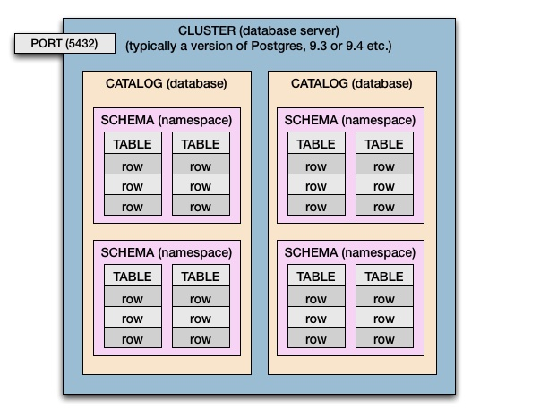

# Basic knowledge about DataBase

## Schema vs Catalog

- A computer may have one cluster or multiple.
- A database server is a cluster.
- A cluster has catalogs. ( Catalog = Database )
- Catalogs have schemas. (Schema = namespace of tables, and security boundary)
- Schemas have tables.
- Tables have rows.
- Rows have values, defined by columns.
- Those values are the business data your apps and users care about such as person's name, invoice due date, product price, gamer’s high score. The column defines the data type of the values (text, date, number, and so on).

