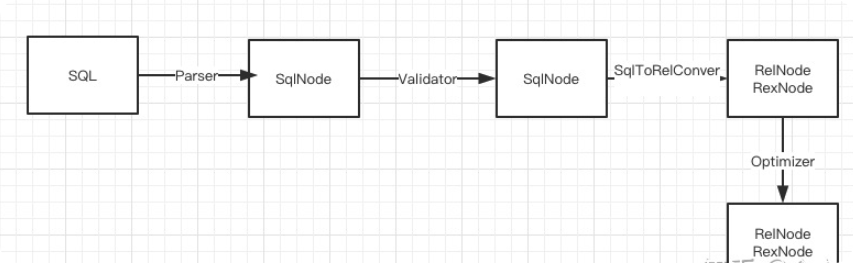

# Concept about Calcite

## Calcite中主要数据结构转化流程



## 1.SQL转SqlNode

通过Parser, 可以将Sql转化成SqlNode, 什么是SqlNode？ SqlNode是Calcite中用于表达关系运算的中间数据结构，这么说可能有些抽象，可以看下图:


便于解释

```Sql
select id, cast(score as int), 'hello' from T where id < ?
```

以上SQL中，
1. id, score, T 等为SqlIdentifier
2. cast()为SqlCall
3. int 为SqlDataTypeSpec
4. 'hello' 为SqlLiteral
5. '?' 为SqlDynamicParam


在Calcite中，所有的操作都是一个SqlCall, 如查询是一个SqlSelect, 删除是一个SqlDelete等，对应的查询条件等为SqlCall中的参数， 如代码所示

```java
public class SqlSelect extends SqlCall {
  public static final int FROM_OPERAND = 2;
  public static final int WHERE_OPERAND = 3;
  public static final int HAVING_OPERAND = 5;

  SqlNodeList keywordList;
  SqlNodeList selectList;
  SqlNode from;
  SqlNode where;
  SqlNodeList groupBy;
  SqlNode having;
  SqlNodeList windowDecls;
  SqlNodeList orderBy;
  SqlNode offset;
  SqlNode fetch;
```

## 2. SqlNode转SqlNode

此过程主要是根据定义的scheam, table, columns 来验证SqlNode是否合法。由于此过程中没有设计数据结构转化，先略过，后面会有文章专们针对validator进行说明

## 3. SqlNode转RelNode

此过程中SqlToRelConverter会将SqlNode转化成RelNode, 这其中主要涉及了以下几个数据结构

- RelNode 关系表达式， 主要有TableScan, Project, Sort, Join等。如果SQL为查询的话，所有关系达式都可以在SqlSelect中找到, 如 where和having 对应的Filter, selectList对应Project, orderBy、offset、fetch 对应着Sort, From 对应着TableScan/Join等等, 示便Sql最后会生成如下RelNode树 LogicalProject LogicalFilter LogicalTableScan
- RexNode 行表达式， 如RexLiteral(常量), RexCall(函数)， RexInputRef(输入引用)等， 还是这一句SQL select id, cast(score as int), 'hello' from T where id < ?, 其中id 为RexInputRef, cast为RexCall, 'hello' 为RexLiteral等
- Traits 转化特征，存在于RelNode中，目前有三种Traits: Convention、RelCollation、 RelDistribution。 Convention指的是改关系表达式所遵循的规范，如SparkConvention、PigConvention， 同一个关系表达式的所有输入必须含有相同的Convention. 可以通过ConverterRule将一个Convention转化成另一个Convention. RelCollation 指的是该关系表达式所定义数据的排序，比如说LogicalSort 中如果RelCollation标识数据如果已经是排序好了，可以消除LogicalSort. RelDistribution 标识数据的分布特点。
- Rule 转化规则，可以将一个RelNode 转化另一种RelNode, 目前Calcite主要有两种Rule. 4.1 直接继承RelOptRule。 这种类型的Rule主要作用是将一个关系表达式转化成等价的另一种表达式 4.2 继承ConverterRule.将RelNode的Convention转化成另一种Convention
- Planners 优化器。主要有两种HepPlanner和VolcanoPlanner分别对应着RBO和CBO优化器


关系运算符
　　  所有关系运算符都实现了RelNode接口， 并且大部分继承自AbstractRelNode类。TableScan, TableModify, Values, ProjectFilter, Aggregate, Join, Sort, Union, Intersect,  Minus, Window和 Match等核心运算符（由 SqlToRelConverter使用 ，覆盖了常规传统的关系代数） 。
　　  上述每一个都有一个“纯”的逻辑子类，LogicalProject 等等。任何给定的适配器都会有引擎可以有效执行操作的对应部分; 例如，Cassandra适配器有 CassandraProject ，但是没有CassandraJoin。
　　  可以定义你自己的RelNode子类来添加一个新的操作符，或者在一个特定的引擎中实现一个现有的运算符。
　　  为了使运算符有用且功能强大，您需要计划器规则将其与现有运算符结合使用。（并提供元数据，见下文）。这是代数，效果是组合的：你写了一些规则，但它们结合起来可以处理指数数量的查询模式。
　　  如果可能的话，让您的运算符成为现有运算符的子类; 那么可以重用或适应其规则。更好的是，如果你的运算符是一个逻辑操作，你可以用现有的运算符来重写（通过计划器规则），尽量应该这样做。您将能够重复使用这些运算符的规则，元数据和实现，而无需额外的工作。
　　计划器规则
　　  计划器规则（RelOptRule类）可以将关系表达式转换为等效的关系表达式。
　　  计划器引擎有许多计划器规则注册并触发它们将输入查询转换为更高效的计划。因此，计划器规则是优化过程的核心，但令人惊讶的是每个计划器规则并不关心成本。计划器引擎负责按顺序发射规则，产生最优计划，但是每个规则只关心它的正确性。
　　  Calcite有两个内置的计划器引擎： VolcanoPlanner 类使用动态编程，对穷举搜索很有效，而 HepPlanner类则以更加固定的顺序触发一系列规则。
　　调用约定
　　  调用约定是特定数据引擎使用的协议。例如，Cassandra 引擎具有关系运算符的集合， CassandraProject，CassandraFilter等等，并且这些操作符可以被相互连接，而无需从一个格式转换成另一种格式的数据。
　　  如果需要将数据从一个调用约定转换为另一个调用约定，则Calcite使用一个称为转换器的特殊关系表达式子类（参见Converter类）。但是，当然，转换数据需要运行成本。
　　在计划使用多个引擎的查询时，Calcite根据其调用约定对关系表达式树的区域进行“着色”。计划器通过触发规则将操作推入数据源。如果引擎不支持特定操作，则规则不会触发。有时一个操作可能发生在多个地方，最终根据成本选择最佳方案。
　　  调用约定是实现了Convention接口，辅助接口（例如CassandraRel接口）和RelNode类的一组子类， 用于实现核心关系运算符（Project，Filter， Aggregate等等）的一个类。
　　内置SQL实现
　　  如果一个适配器没有实现所有核心关系运算符，Calcite如何实现SQL？
　　  答案是一个特定的内置调用约定EnumerableConvention。可枚举约定的关系表达式被实现为“内置”：Calcite生成Java代码，编译并在其自己的JVM中执行它。可枚举约定比运行在列式数据文件上的分布式引擎效率低，但可以实现所有核心关系运算符以及所有内置的SQL函数和运算符。如果一个数据源不能实现一个关系运算符，则枚举约定是一个回退。


## 4.SqlNode to RelNode

此过程中SqlToRelConverter会将SqlNode转化成RelNode, 这其中主要涉及了以下几个数据结构

1. RelNode关系表达式， 主要有TableScan, Project, Sort, Join等。如果SQL为查询的话，所有关系达式都可以在SqlSelect中找到, 如 where和having 对应的Filter, selectList对应Project, orderBy、offset、fetch 对应着Sort, From 对应着TableScan/Join等等, 示便Sql最后会生成如下RelNode树 LogicalProject LogicalFilter LogicalTableScan
2. RexNode行表达式， 如RexLiteral(常量), RexCall(函数)， RexInputRef(输入引用)等， 还是这一句SQL select id, cast(score as int), 'hello' from T where id < ?, 其中id 为RexInputRef, cast为RexCall, 'hello' 为RexLiteral等

3. Traits转化特征，存在于RelNode中，目前有三种Traits: Convention、RelCollation、 RelDistribution。 
   - Convention指的是改关系表达式所遵循的规范，如SparkConvention、PigConvention， 同一个关系表达式的所有输入必须含有相同的Convention. 可以通过ConverterRule将一个Convention转化成另一个Convention. 
   - RelCollation 指的是该关系表达式所定义数据的排序，比如说LogicalSort 如果RelCollation标识数据如果已经是排序好了，可以消除LogicalSort.
   - RelDistribution 标识数据的分布特点。

4. Rule 转化规则，可以将一个RelNode 转化另一种RelNode, 目前Calcite主要有两种Rule. 4.1 直接继承RelOptRule。 这种类型的Rule主要作用是将一个关系表达式转化成等价的另一种表达式 4.2 继承ConverterRule.将RelNode的Convention转化成另一种Convention

5. Planners 优化器。主要有两种HepPlanner和VolcanoPlanner分别对应着RBO和CBO优化器

## 5. HepProgramBuilder介绍

先初始化 HepProgramBuilder 也是为了后面初始化 HepProgram 做准备，HepProgramBuilder 主要也就是提供了一些配置设置和添加规则的方法等，常用的方法如下：

- addRuleInstance()：注册相应的规则；
- addRuleCollection()：这里是注册一个规则集合，先把规则放在一个集合里，再注册整个集合，如果规则多的话，一般是这种方式；
- addMatchLimit()：设置 MatchLimit，这个 rule match 次数的最大限制；
- addMatchOrder() Rule 匹配的顺序
  
HepProgram 这个类对于后面 HepPlanner 的优化很重要，它定义 Rule 匹配的顺序，默认按【深度优先】顺序，它可以提供以下几种（见 HepMatchOrder 类):
- ARBITRARY：按任意顺序匹配（因为它是有效的，而且大部分的 Rule 并不关心匹配顺序）；
- BOTTOM_UP：自下而上，先从子节点开始匹配；
- TOP_DOWN：自上而下，先从父节点开始匹配；
- DEPTH_FIRST：深度优先匹配，某些情况下比 ARBITRARY 高效（为了避免新的 vertex 产生后又从 root 节点开始匹配）。

这个匹配顺序到底是什么呢？对于规则集合 rules，HepPlanner 的算法是：从一个节点开始，跟 rules 的所有 Rule 进行匹配，匹配上就进行转换操作，这个节点操作完，再进行下一个节点，这里的匹配顺序就是指的节点遍历顺序（这种方式的优劣，我们下面再说）。


## 相关的疑问

1、Traits如何理解？

```java
public RelNode optimize(RelNode relNode, Convention convention) {
        RelTraitSet traitSet = planner.emptyTraitSet().replace(convention);
        List<RelOptRule> rules = DingoRules.rules();
```
