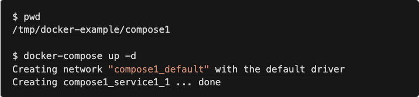
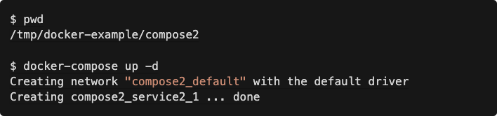
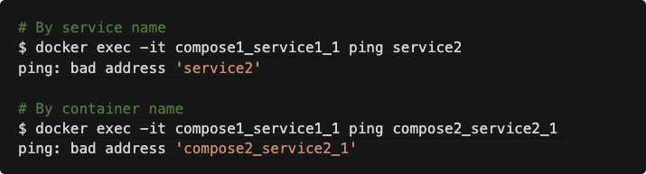
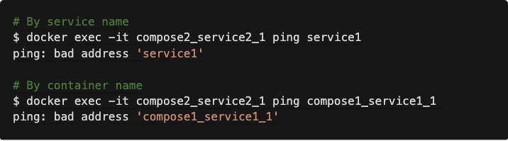

# How to link multiple docker-compose services via network

This scenario came from a question I was asked docker-compose and network connectivity between services defined in different docker-compose.yml files.

The desired result was to be able to define a docker-compose.yml in one file, and in a second docker-compose.yml have the ability to reach the first service via service or container name for development purposes.

## Default scenario: Two separate docker-compose.yml and two separate default networks


When it starts up, a default network is created. Its name is based on the service name and the directory name of the docker-compose.yml file.



### Second docker compose file


Starting services in a second docker compose file, we see the same behavior. A new default network is created and used.



A side-effect of these isolated networks are that the containers are unable to ping one another by service name or container name.

### Test: From Service 1 ping Service 2



### Test: Service 2 ping Service 1


## New scenario: Sharing a network between services

If you want define services in multiple docker-compose.yml files, and also have network connectivity between the services, you need to configure your services to use the same network.

To create an external network, you can run ```docker network create <name>```. -- where <name> can be a single string without spaces.

### Creating the network


### Modified first docker-compose file with network configured


Restarting the services


### Modified second docker-compose file with network configured


Restarting the services


After running `docker-compose up -d` on both docker-compose.yml files, we see that no new networks were created.

## Takeaway
You can connect services defined across multiple docker-compose.yml files. In order to do this you’ll need to:

- Create an external network with docker network create <network name>
- In each of your docker-compose.yml configure the default network to use your externally created network with the networks top-level key.
- You can use either the service name or container name to connect between containers.